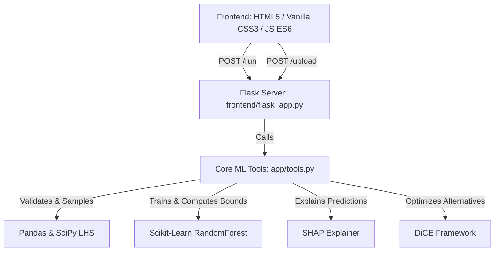
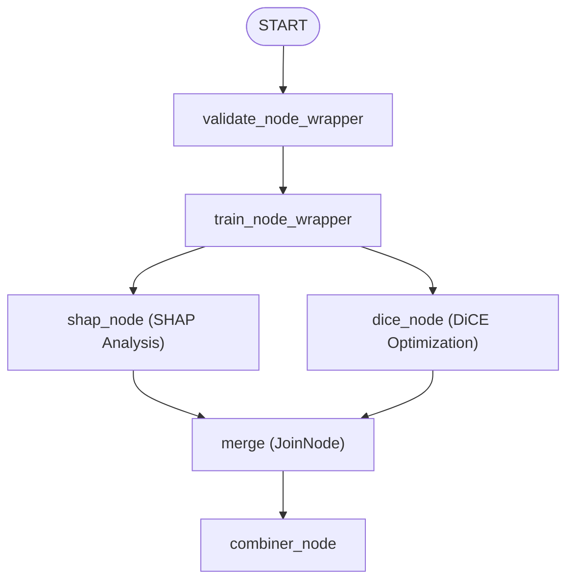

# DiCE & SHAP ML Research Assistant

An interactive, glassmorphic Flask-based web application designed to validate datasets, train Random Forest Regressors, perform SHAP analysis, and compute DiCE counterfactual recommendations.

---

## Capabilities & Key Features

1. **Dataset Validation & Advanced Sampling**:
   - Accepts CSV and Excel files containing up to **50 feature columns**.
   - Applies size-aware sampling: under 3,000 rows uses the full dataset; between 3,000 and 10,000 rows applies random sampling; **over 10,000 rows** uses a **Latin Hypercube Sampling (LHS)** mapped to actual rows using Euclidean nearest-neighbor distance to select a highly representative subset of exactly 3,000 samples.
   - Dynamic UI banner displays the exact sampling method applied to the uploaded dataset.

2. **Model Training & OOB Metrics**:
   - Trains a `RandomForestRegressor` with out-of-bag scoring enabled (`oob_score=True`).
   - Computes and displays Train $R^2$, Test $R^2$, and Out-of-Bag (OOB) scores in glassmorphic metrics cards.
   - Saves model training cache (`models/rf_model.pkl`) to bypass retraining on subsequent query executions.

3. **Combined Fit Plot & Prediction Intervals**:
   - Computes 95% prediction intervals (2.5% and 97.5% quantiles of tree predictions) on the training set.
   - Renders a single combined plot overlaying training predictions (complete with error bars for every sample) and test set predictions (styled as dark red dots).

4. **Exploration & Correlation Heatmaps**:
   - Computes a Pearson correlation matrix for all numeric columns.
   - Generates a Seaborn heatmap using a warm (`YlOrRd`) color spectrum.
   - Dynamically lists the **top 10 unique, absolute correlation contributions** in the sidebar.

5. **SHAP Feature Interpretability**:
   - Generates beeswarm and bar feature importance charts using SHAP `TreeExplainer`.
   - Generates a custom SHAP waterfall chart specifically depicting feature contributions for the *current query instance*.

6. **Conservative Model Wrapper**:
   - Allows users to choose between `Standard (Mean Prediction)` and `Conservative (97.5% Confidence Lower Bound)` optimization strategies.
   - The conservative mode wraps the model, directing the DiCE optimizer to suggest adjustments until the bottom of the 95% prediction interval is above the selected threshold.

7. **Interactive DiCE Recommendations & Custom Types**:
   - Displays baseline query inputs directly in editable text boxes.
   - Renders recommended counterfactual rows (up to 10 alternatives) in a dynamic table.
   - Highlights feature changes in green and displays the expected predictions alongside the predicted lower bounds.
   - Allows users to customize datatypes (`Integer` vs `Float`) for each feature column via dropdown menus, automatically updating input step sizes and rounding recommendations matching user selections.

---

## System Architecture Layers



- **Frontend Interface (`frontend/templates/`, `frontend/static/`)**: A premium dark-mode glassmorphic single-page app utilizing CSS variables, Outfit/Google fonts, micro-interactions, responsive flex-grid cards, and asynchronous AJAX payloads.
- **Backend Controller (`frontend/flask_app.py`)**: Orchestrates the API requests, handles model pickling/caching lifecycle, and handles type conversion logic.
- **Core ML Library (`app/tools.py`)**: Declares the `ConservativeModel` wrapper, LHS nearest neighbors mapping, SHAP plot generators, and DiCE explainer routines.

---

## ADK Workflow Graph

The core research agent utilizes a structured ADK workflow graph (defined in [app/agent.py](file:///Users/mgabr001/Capstone_5day_AI_Agent_Vibe/DiCE-Counterfactuals/dice-counterfactuals-agent/app/agent.py)) to orchestrate dataset validation, model training, and model interpretability. SHAP analysis and DiCE optimization are executed in parallel to maximize performance:



---

## Environment Setup & Run Instructions

Ensure you have Python 3.12 and [uv](https://docs.astral.sh/uv/) installed.

### 1. Initialize Virtual Environment & Install Dependencies

From the project root directory, run:

```bash
# Create and synchronize the local virtual environment
uv sync
```

### 2. Run the Web Application

Start the Flask development server on port `5001`:

```bash
# Launch the web application
uv run python frontend/flask_app.py
```

Open your browser and navigate to:
👉 **[http://127.0.0.1:5001](http://127.0.0.1:5001)**

### 3. Running Unit Tests

To run the workflow integration tests:

```bash
uv run pytest tests/unit/test_workflow.py
```
